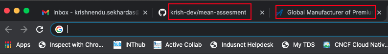

# MEAN Stack - Assessment

### Score (Total 100 points)

- Node, Express and Mongo: **40 points**
- Angular: **30 points**
- Code Quality & Code Documentation: **30 points**

### Understanding of data and schema

We are providing a set of **career** dataset, This dataset having total **1473** records. In the below will find a sample record.

```json
{
  "title": "Leather craftworker",
  "category": "Manufacturing",
  "altTitle": ["Leather worker", "saddler"],
  "description": "Leather craftworkers make clothes, shoes and accessories from leather, using traditional methods.",
  "weeklyWorkHours": {
    "max": 40,
    "min": 38,
    "schedule": "a week"
  },
  "url": "https://nationalcareers.service.gov.uk/job-profiles/leather-craftworker",
  "slug": "manufacturing-leather-craftworker",
  "yearlyAvgSalary": [
    {
      "currency": "GBP",
      "type": "starter",
      "value": 14000
    },
    {
      "currency": "GBP",
      "type": "experienced",
      "value": 22000
    }
  ]
}
```

### Description of major field

| Field        | Type            | Description                                |
| ------------ | --------------- | ------------------------------------------ |
| **title**    | string          | Title of career profile                    |
| **altTitle** | array< string > | Alternative title of career profile        |
| **category** | string          | career profile category                    |
| **slug**     | string          | A unique identifier of each career profile |

## Task 1 - Node, Express and Mongo [40 points]

- [Download the dataset from here](./data/career-data.json) and dump the data into your local mongodb server. Click on the link then click on `Raw` option then save the json file.
  - Db name should be `assestment_3_db` and collection name should be `career`.
  - Node and monogo DB connection credential should maintain via a configuartion file.
- **[ 30 Points ]** Write a `GET` API, endpoint would be `/search`. this endpoint should accept 2 parameters: `text` and `limit`.
  - The search will perform on following filed into `career` collection : `title`, `altTitle` and `category`.
  - Response data should be array of object and should content all filed of matched record except `url`.
  - Partial string match will also return data.
  - `text` parameter should have a validation of minimum `3` characters.
  - `limit` is an optional field. Maximum count of the result whould same as limit. default `limit` should be `10`.
  - If search not matched then it should handled via proper status code.
- **[ 10 Points ]** Write a `GET` API, endpoint would be `/profile/:slug`.
  - This api will return only one record or zero for invalid `slug`.
  - `/:slug` is the same filed into the collection of each record, named `slug`.

## Task 2 - Angular [30 points]

- Angular version should be 10.
- **[ 10 Points ]** Create a `Seach` page which should access via `localhost:port`
  - This page should have a input search text field. There should not be any button to trigger the `/search` api. The search API will automatically trigger as soon as input filed have minimum `3` characters.
  - The response data will show into a `datatable` (must). Datatable should have `Title`, `Description` and `Action` Button or link to navigate to the `Career Profile` page.
- **[ 20 Points ]** Create a `Career Profile` page which should access via `localhost:port/:slug`
  - This page will capture `slug` from URL and trigger the `/profile/:slug` to get details.
  - Display the `title`, `description` and `category` into the page.
  - Update page's `meta` `title` and `description`. It should reflect into browser tab text in top. It will looks similer as red marked in the sample image below.
    

## Source Code submition

Source code should be submit via provided google form link via email. Make a zip of 2 the source code (Angular and Node) without `node_module` separatly. Size limit of each zip file is 10 MB. If the file size is more than 10 MB it means you have lots of junk file. We are not accepting such source code.
